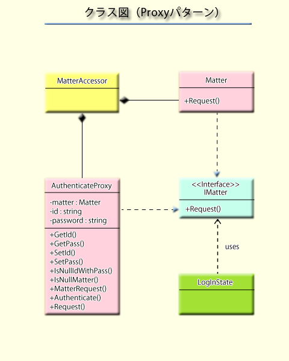

ACTIONGAME
=========
 制作中のゲーム（Unity3D）

###開発中の画面

 
 
###状態遷移の資料
 
*シーン遷移*
 

 
*NPCAI*
 

 
 
###クラス図（一部）
 

 
_開発環境　Unity ver 4.6.1f1_

_使用アセット（フリー）_
----- 下記アセットはインポート不要です。 -----
 ・Tiny Fantasy Actor Pack #1
 ・Two-Swords Warrior
 ・Tiny Archer Man
 ・Monster
 ・Cartoony Medieval Weapon package
 ・Ornamental Flower Set
 ・Rune Sword
 ・Pixel Map Terrain
 ・Unirx
 ・Minijson
 ・LitJson
 ・JSONObject

*音楽*
 魔王魂

_チュートリアル_
 ・マウス左クリックで移動、エネミーをクリックするとアタック（押下し続けるとそのまま継続）
 ・マウス右クリック+ドラッグで視点調整
